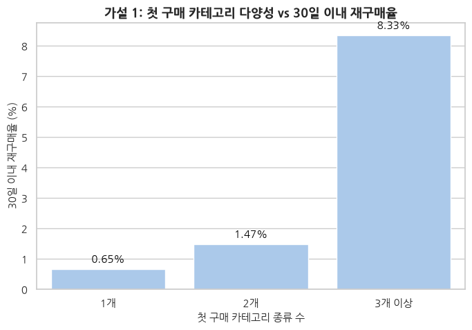
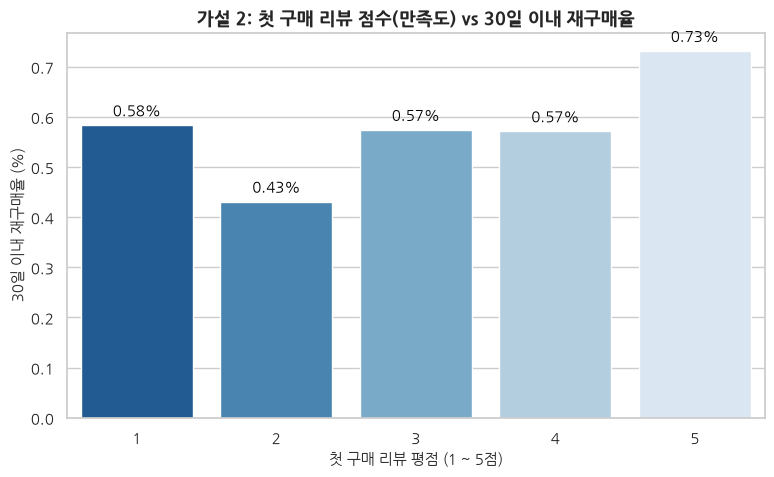
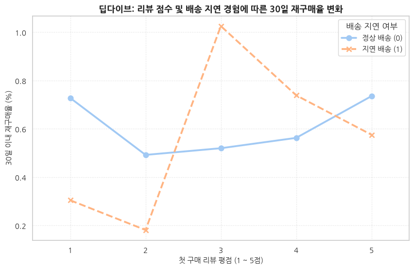
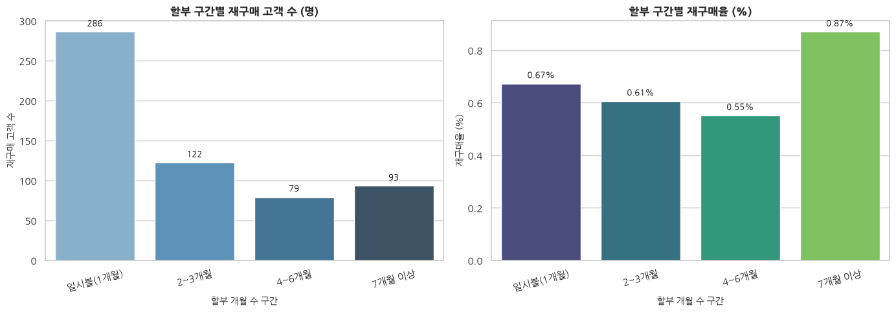
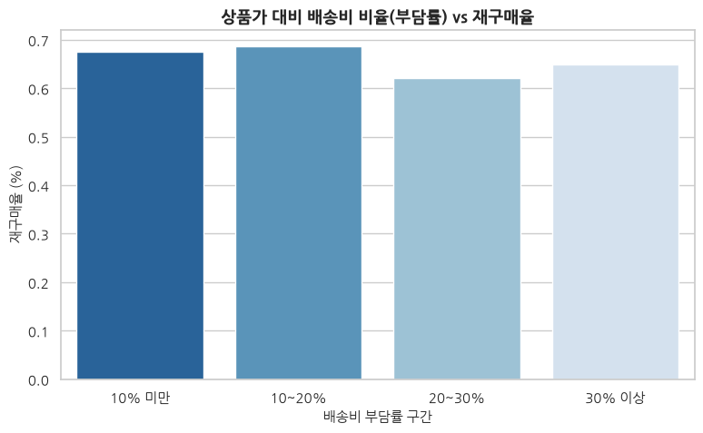
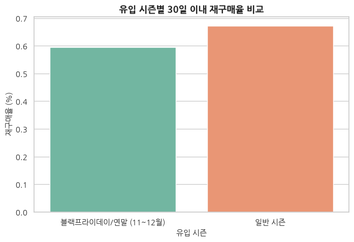
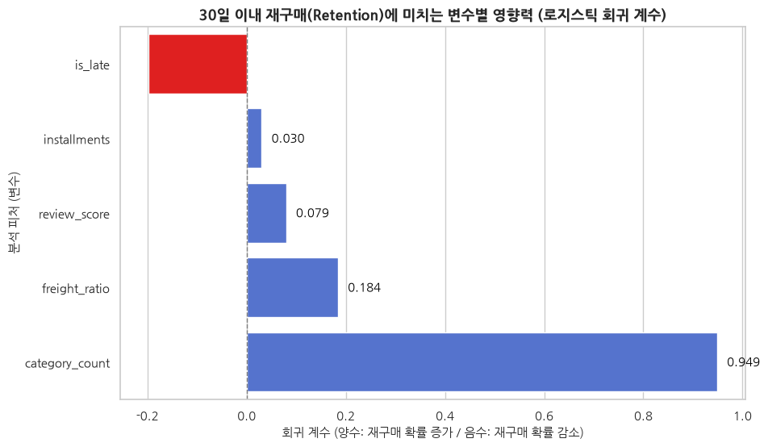

# Olist 고객 세분화 및 저평점 리뷰 분석

> 첫 구매 이후 반복 구매가 적은 상황에서, 모든 고객에게 같은 전략을 적용하는 대신 개선 우선순위가 높은 고객 경험을 찾은 프로젝트

---

## 1. 프로젝트 요약

Olist 이커머스 데이터에서 두 번 이상 주문한 고객은 전체의 3.04%였다. 그러나 전체 고객의 평균만 비교해서는 어떤 고객에게 어떤 조치를 먼저 취해야 하는지 결정하기 어려웠다.

이에 고객을 구매 시점, 구매금액, 첫 주문의 카테고리 수와 리뷰 점수로 세분화하고, 각 고객군의 규모·구매가치·경험 신호를 비교했다. 이후 가장 낮은 만족도를 보인 고객군의 1~2점 리뷰를 다시 분석해 구체적인 불만 유형을 확인했다.

분석 결과, 실행 우선순위가 높은 집단으로 다음 두 고객군을 선정했다.

1. 평균 평점이 1.54점인 **저평점 장기 미방문군**: 고객 경험 회복 대상
2. 평균 구매금액이 303.33헤알인 **고액 고평점 장기 미방문군**: 재활성화 대상

저평점 장기 미방문군의 리뷰에서는 **미수령**이 가장 많이 탐지됐으며, 부분배송·상품 누락, 배송 지연, 파손·불량, 환불·고객센터 대응 문제도 반복적으로 나타났다.

---

## 2. 프로젝트 개요

| 구분 | 내용 |
|---|---|
| 분석 주제 | 고객 세분화를 통한 고객 경험 개선 및 재활성화 대상 발굴 |
| 데이터 | Olist Brazilian E-Commerce Public Dataset |
| 분석 단위 | 주문 단위 정제 후 고객 단위 분석 |
| 주요 방법 | 데이터 정합성 검증, RFM, K-Means, Elbow Method, 리뷰 텍스트 규칙 기반 멀티라벨 분석 |
| 주요 도구 | Python, pandas, NumPy, scikit-learn, Jupyter Notebook |
| 최종 군집 수 | 5개 |
| 군집 분석 고객 | 92,718명 |
| 30일 재구매 관찰 가능 고객 | 89,895명 |
| 핵심 산출물 | 고객군 프로필, 타겟 우선순위, 저평점 리뷰 유형, 실험 및 KPI 제안 |

---

## 3. 문제 정의

### 3.1 관찰된 문제

고객의 3.04%만 두 번 이상 주문했다. 데이터에 가입일이 없으므로 이를 신규 가입자의 이탈 문제로 단정하지 않고, **첫 구매 이후 반복 구매로 이어지는 고객이 적다**는 문제로 정의했다.

단기 반복 구매를 비교하기 위한 보조 지표는 `첫 구매 후 30일 이내 재구매`로 설정했다.

- 같은 날짜에 발생한 여러 주문은 분리 결제나 주문 분할 가능성이 있어 하나의 구매일로 처리했다.
- 첫 구매 후 1~30일 사이에 다른 구매일이 있을 때만 재구매로 정의했다.
- 데이터 종료일까지 30일을 관찰할 수 없는 고객은 재구매율 분모에서 제외했다.

이 기준에서 30일 관찰 가능 고객은 89,895명이며, 30일 이내 재구매율은 0.66%였다.

### 3.2 핵심 분석 질문

> 모든 고객을 다시 부르려 하기보다, 어떤 고객 경험을 우선 개선해야 하는가?

### 3.3 분석 가설

초기 분석은 다음과 같은 고객 경험 및 구매 특성이 재구매 행동과 관련될 가능성을 탐색하는 데서 시작했다.

- 첫 주문에서 여러 카테고리를 경험한 고객은 재구매 가능성이 다를 수 있다.
- 첫 주문의 낮은 리뷰 점수는 이후 미재구매와 관련될 수 있다.
- 배송 지연이나 높은 배송비 부담은 이후 구매를 저해할 수 있다.
- 전체 평균은 서로 다른 고객군의 행동과 경험 차이를 가릴 수 있다.

이 가설들은 원인과 결과를 확정하기 위한 것이 아니라, 고객 세분화와 후속 검증의 출발점으로 사용했다.

---

## 4. EDA: 문제 정의와 가설 수립 근거

가설별 EDA에서는 첫 주문 시점에 알 수 있는 고객 경험과 구매 특성을 기준으로 30일 이내 재구매율을 비교했다. 이후 5개 변수를 함께 투입한 로지스틱 회귀로 다른 변수들을 통제했을 때도 같은 방향이 관찰되는지 확인했다.

시각화는 패턴을 탐색하기 위한 자료이고, 회귀 결과 역시 관찰 데이터의 연관성을 나타낸다. 따라서 아래 결과를 특정 변수가 재구매를 직접 일으킨다는 인과관계로 해석하지 않았다.

### 4.1 가설 1: 첫 구매 카테고리가 다양할수록 재구매율이 높을 것이다



- **그래프:** 카테고리 수가 많은 그룹에서 재구매율이 높게 나타남
- **계수:** `0.9486` → 카테고리가 1개 늘면 재구매 오즈가 약 2.58배로 증가
- **p-value:** `0.001` → 유의수준 5%에서 통계적으로 유의함
- **95% 신뢰구간:** 계수 `[0.364, 1.533]` → 0을 포함하지 않아 양의 연관성을 지지함
- **주의:** 다중 카테고리 고객은 전체의 0.71%뿐이므로 전체 고객에게 일반화하기 어려움

### 4.2 가설 2: 첫 구매 리뷰 만족도가 높을수록 재구매율이 높을 것이다



- **그래프:** 리뷰 점수별 재구매율은 단조롭게 증가하지 않음
- **계수:** `0.0795` → 리뷰가 1점 높아질 때 재구매 오즈가 약 8.3% 증가
- **p-value:** `0.027` → 유의수준 5%에서 통계적으로 유의함
- **95% 신뢰구간:** 계수 `[0.009, 0.150]` → 0을 포함하지 않지만 효과 크기는 작음
- **주의:** 리뷰 작성 고객만 관찰되므로 만족도가 재구매의 직접 원인이라고 단정할 수 없음

### 4.3 리뷰와 배송 지연 교차분석



- **그래프:** 같은 리뷰 점수에서도 배송 지연 여부에 따라 재구매율 차이가 나타남
- **계수:** `-0.1975` → 배송 지연 고객의 재구매 오즈가 약 17.9% 낮은 방향
- **p-value:** `0.297` → 유의수준 5%에서 통계적으로 유의하지 않음
- **95% 신뢰구간:** 계수 `[-0.569, 0.174]` → 0을 포함해 효과 방향을 확정할 수 없음
- **판단:** 배송 지연의 독립적인 영향을 확인하지 못했으며 상품·판매자·지역 등의 추가 통제가 필요함

### 4.4 가설 3: 할부 가능 개월 수가 길수록 재구매율이 높을 것이다



- **그래프:** 할부 구간별 재구매 고객 수와 재구매율에 차이가 나타남
- **계수:** `0.0302` → 할부가 1개월 늘면 재구매 오즈가 약 3.1% 증가
- **p-value:** `0.045` → 유의수준 5%에서 경계선 수준으로 유의함
- **95% 신뢰구간:** 계수 `[0.001, 0.060]` → 0에 매우 가까워 효과가 작고 불확실함
- **주의:** 상품 가격과 결제 성향이 함께 반영될 수 있어 할부 기간 자체의 효과로 단정할 수 없음

### 4.5 가설 4: 첫 구매 배송비 부담률이 높을수록 재구매율이 낮을 것이다



- **그래프:** 배송비 부담률이 높을수록 재구매율이 낮아지는 일관된 패턴이 나타나지 않음
- **계수:** `0.1841` → 예상과 달리 양의 방향이지만 효과를 확정할 수 없음
- **p-value:** `0.591` → 유의수준 5%에서 통계적으로 유의하지 않음
- **95% 신뢰구간:** 계수 `[-0.487, 0.855]` → 0을 포함하고 범위가 넓음
- **판단:** 배송비 부담이 재구매를 낮춘다는 가설을 지지할 근거를 확보하지 못함

### 4.6 가설 5: 이벤트 시즌에 유입된 고객의 재구매율이 낮을 것이다



- **그래프:** 11~12월 유입 고객과 일반 시즌 고객의 재구매율 차이를 비교함
- **분석 수준:** 기술 통계 비교이며 다변량 회귀에는 포함하지 않음
- **한계:** 실제 행사일·할인 수준·유입 채널을 통제하지 않아 이벤트 효과로 해석할 수 없음
- **판단:** 캠페인 일정과 유입 정보가 확보된 후 이벤트별 코호트 분석이 필요함

### 4.7 다변량 로지스틱 회귀



- **분석 표본:** 결측치를 제외한 87,748명
- **목적:** 5개 변수를 함께 고려했을 때 각 변수와 재구매의 독립적인 연관성 확인

```text
target_30d ~ category_count + review_score + is_late
             + freight_ratio + installments
```

| 변수 | 계수 | 95% 신뢰구간 | p-value | 판단 |
|---|---:|---:|---:|---|
| 첫 구매 카테고리 수 | 0.9486 | 0.364~1.533 | 0.001 | 유의한 양의 연관성 |
| 첫 구매 리뷰 점수 | 0.0795 | 0.009~0.150 | 0.027 | 작지만 유의한 양의 연관성 |
| 할부 개월 수 | 0.0302 | 0.001~0.060 | 0.045 | 경계선 수준의 양의 연관성 |
| 배송 지연 여부 | -0.1975 | -0.569~0.174 | 0.297 | 유의하지 않음 |
| 배송비 부담률 | 0.1841 | -0.487~0.855 | 0.591 | 유의하지 않음 |

- **모형 전체:** LLR p-value `0.001429` → 절편만 있는 모형보다는 통계적으로 개선됨
- **설명력:** Pseudo R² `0.002821` → 실제 재구매 행동을 설명하는 힘은 매우 낮음
- **결론:** 일부 연관성은 확인됐지만 이 변수들만으로 재구매를 충분히 설명하거나 예측할 수 없음

### 4.8 가설 검증에서 고객 세분화로의 전환

가설 검증 결과는 다음과 같이 정리된다.

- 카테고리 다양성은 강한 신호였지만 해당 고객이 매우 희소했다.
- 리뷰 점수는 유의한 보조 신호였지만 인과관계는 확인되지 않았다.
- 할부 개월 수는 작은 양의 연관성이 있었으나 가격과 결제 성향의 영향이 섞여 있다.
- 배송 지연과 배송비 부담률은 현재 모형에서 유의하지 않았다.
- 전체 모형의 설명력은 매우 낮았다.

즉, 한 가지 가설로 전체 고객을 설명하기보다 서로 다른 구매가치와 경험을 가진 고객을 나눠 볼 필요가 있었다. 이 판단을 바탕으로 분석 방향을 고객 세분화로 전환했다.

### 4.9 추후 보완할 EDA

현재 가설별 시각화와 회귀 분석은 반영했으며, 포트폴리오 완성도를 높이기 위해 다음 기초 EDA는 추후 추가한다.

- 전체 고객 수와 주문 횟수별 고객 분포
- 1회 구매 고객과 반복 구매 고객 비중 시각화
- 고객별 첫 구매일과 재구매 간격 분포
- 리뷰 점수, 배송 지연 일수, 구매금액, 배송비 부담률의 기초 분포
- 변수별 표본 수와 신뢰구간
- 분석 기간 및 오른쪽 관찰 중단 문제를 보여주는 도식

추가 EDA는 다음 흐름으로 기존 가설 검증 앞부분을 보강한다.

```text
데이터 구조와 품질 확인
→ 반복 구매가 적다는 현상 확인
→ 경험·구매 특성별 차이 탐색
→ 전체 평균 분석의 한계 확인
→ 고객 세분화 필요성 도출
```

---

## 5. 데이터 정제와 분석 설계

### 5.1 주문 단위 중복 방지

Olist 데이터는 주문, 상품, 결제, 리뷰가 서로 다른 단위로 저장되어 있다. 이를 한 번에 결합하면 상품이나 결제 행 수만큼 동일 결제액이 반복되어 고객의 구매금액이 과대 집계될 수 있다.

이를 방지하기 위해 다음 순서로 데이터를 정리했다.

1. 결제액을 주문 단위로 합산
2. 상품 카테고리 수를 주문 단위로 집계
3. 리뷰 ID 중복 제거 후 주문 단위 리뷰 점수 계산
4. 주문당 한 행인 `order_level` 테이블 생성
5. 주문 ID의 유일성을 검증한 후 고객 단위 RFM 계산

검증 결과 주문 단위 행 수와 고유 주문 수는 모두 98,202건으로 일치했다.

### 5.2 고객 단위 변수

| 변수 | 의미 | 활용 |
|---|---|---|
| Recency | 기준일로부터 마지막 구매일까지의 경과일 | 최근성 및 미방문 기간 |
| Frequency | 고객의 고유 구매일 수 | 고객 프로필 설명 |
| Monetary | 고객의 실제 결제금액 합계 | 구매가치 |
| category_count | 첫 주문의 카테고리 수 | 첫 구매 경험의 다양성 |
| review_score | 첫 주문 리뷰 점수 | 첫 경험 만족도 신호 |
| target_30d | 첫 구매 후 30일 내 재구매 여부 | 군집 생성 후 사후 비교 |

`target_30d`는 군집 입력 변수로 사용하지 않았다. 결과를 미리 군집에 반영한 뒤 같은 결과로 군집을 평가하는 순환 논리를 피하기 위해서다.

### 5.3 군집화 전처리

- 입력 변수: Recency, Monetary, 첫 주문 카테고리 수, 첫 주문 리뷰 점수
- Recency, Monetary, 카테고리 수에 `log1p` 변환 적용
- 모든 입력 변수를 표준화
- Monetary 상위 1% 고객은 삭제하지 않고 군집 거리 계산용 값에만 상한 적용
- 첫 주문 리뷰나 카테고리 정보가 없는 고객은 군집 분석에서 제외

최종 군집 분석 대상은 92,718명이다.

---

## 6. 최적 군집 수 선정

`k=2~8`의 K-Means 모델을 각각 학습하고 Inertia를 비교했다. 정규화한 Inertia 곡선과 양 끝점을 연결한 직선 사이의 거리가 가장 큰 지점을 Elbow로 선택했다.

| k | Inertia | Elbow 거리 | Elbow 강도 |
|---:|---:|---:|---:|
| 2 | 294,673.73 | 0.0000 | 0.0000 |
| 3 | 204,158.20 | 0.2540 | 0.7098 |
| 4 | 149,300.75 | 0.3423 | 0.9565 |
| 5 | 110,085.74 | **0.3578** | **1.0000** |
| 6 | 97,811.70 | 0.2482 | 0.6937 |
| 7 | 88,228.67 | 0.1261 | 0.3524 |
| 8 | 79,497.46 | 0.0000 | 0.0000 |

가장 강한 굴곡점이 나타난 `k=5`를 최종 군집 수로 선정했다. 군집 번호 자체에는 순서나 우열의 의미가 없으므로, 결과 해석에서는 번호보다 고객군 이름을 사용했다.

---

## 7. 고객 세분화 결과

| 고객군 | 고객 수 | 비중 | 평균 Recency | 평균 Monetary | 평균 카테고리 수 | 평균 평점 | 재구매 고객/관찰 고객 | 30일 재구매율 |
|---|---:|---:|---:|---:|---:|---:|---:|---:|
| 저액 고평점 장기 미방문군 | 35,030 | 37.78% | 296.21일 | 66.76헤알 | 1.00 | 4.62 | 75/35,030 | 0.21% |
| 저평점 장기 미방문군 | 14,976 | 16.15% | 252.57일 | 180.08헤알 | 1.00 | 1.54 | 78/14,725 | 0.53% |
| 희소 다중 카테고리군 | 668 | 0.72% | 218.32일 | 271.95헤알 | 2.02 | 3.06 | 11/615 | 1.79% |
| 최근 구매 고평점군 | 15,853 | 17.10% | 48.63일 | 136.48헤알 | 1.00 | 4.60 | 73/11,114 | 0.66% |
| 고액 고평점 장기 미방문군 | 26,191 | 28.25% | 282.70일 | 303.33헤알 | 1.00 | 4.66 | 344/26,191 | 1.31% |

### 7.1 우선순위 선정 기준

재구매율 한 가지 지표만으로 타겟을 선정하지 않았다. 다음 네 기준을 함께 고려했다.

1. 충분한 고객 규모가 있는가?
2. 구매가치가 있는가?
3. 개선이 필요한 고객 경험 신호가 있는가?
4. 실행 가능한 대응 방안이 있는가?

### 7.2 핵심 타겟 1: 저평점 장기 미방문군

- 고객 14,976명, 전체의 16.15%
- 평균 리뷰 점수 1.54점으로 다섯 군집 중 최저
- 평균 Monetary 180.08헤알
- 평균 Recency 252.57일

규모가 충분하고 낮은 만족도와 장기 미방문이 동시에 나타난다. 따라서 할인 쿠폰을 일괄 제공하기보다, 저평점의 구체적인 원인과 사후 처리 경험을 개선해야 하는 고객군으로 판단했다.

### 7.3 핵심 타겟 2: 고액 고평점 장기 미방문군

- 고객 26,191명, 전체의 28.25%
- 평균 Monetary 303.33헤알로 다섯 군집 중 최고
- 평균 리뷰 점수 4.66점
- 평균 Recency 282.70일

과거 구매가치와 긍정적인 경험은 확인되지만 오랫동안 다시 방문하지 않았다. 문제 보상보다는 구매 주기 기반 리마인드, 재입고 알림, 연관 상품 추천과 같은 재방문 계기 제공이 적합한 고객군이다.

### 7.4 탐색 대상: 희소 다중 카테고리군

평균 카테고리 수와 30일 재구매율은 가장 높지만 고객은 668명, 실제 30일 재구매 고객은 11명뿐이다. 작은 수의 변화에도 비율이 크게 달라질 수 있어 핵심 타겟에서 제외하고, 복수 상품 주문의 피킹·패킹과 부분 배송 경험을 확인하는 소규모 조사 대상으로 분류했다.

---

## 8. 저평점 리뷰 딥다이브

### 8.1 분석 대상과 중복 제거

저평점 장기 미방문군을 주문·고객·리뷰 데이터에 다시 연결했다. 텍스트가 존재하는 1~2점 리뷰만 사용하고 다음 세 값이 모두 같은 경우 하나의 리뷰 이벤트로 처리했다.

```text
customer_unique_id + 정규화된 리뷰 텍스트 + review_score
```

- 저평점 리뷰 이벤트: 9,233건
- 분석 고객: 9,183명
- 1점 리뷰: 7,438건
- 2점 리뷰: 1,795건
- 1점 리뷰는 2점 리뷰의 약 4.1배

### 8.2 주요 불만 유형

한 리뷰에 여러 문제가 함께 등장할 수 있어 멀티라벨 방식으로 분류했다. 따라서 유형별 비중의 합은 100%가 되지 않는다.

| 불만 유형 | 1점 | 2점 | 합계 | 전체 저평점 이벤트 비중 |
|---|---:|---:|---:|---:|
| 미수령 | 2,070 | 254 | 2,324 | 25.2% |
| 부분배송·상품 누락 | 732 | 151 | 883 | 9.6% |
| 배송 지연 | 489 | 147 | 636 | 6.9% |
| 파손·불량 | 438 | 106 | 544 | 5.9% |
| 환불·고객센터 대응 | 432 | 43 | 475 | 5.1% |
| 품질 불만 | 341 | 68 | 409 | 4.4% |
| 오배송 | 160 | 25 | 185 | 2.0% |
| 배송완료 오표시 | 145 | 21 | 166 | 1.8% |

### 8.3 핵심 발견

#### 미수령이 가장 많이 탐지된 단일 이슈

미수령은 전체 저평점 이벤트의 25.2%인 2,324건에서 탐지됐다. 부분배송·상품 누락과 배송완료 오표시도 같은 수령 경험의 문제로 이어질 수 있다. 주문 처리, 피킹·패킹, 부분 배송, 상품 라인별 배송상태 연결을 함께 점검할 필요가 있다.

#### 운영 문제 표현이 1점 리뷰에 집중

미수령 2,324건 중 2,070건, 부분배송·누락 883건 중 732건, 환불·고객센터 대응 475건 중 432건이 1점 리뷰였다. 이는 운영 문제와 매우 낮은 평가가 함께 나타나는 신호지만, 텍스트 빈도만으로 직접적인 인과관계를 확정할 수는 없다.

#### 배송완료 오표시는 물류와 데이터 품질의 교차 문제

실제 수령 여부와 시스템의 배송완료 상태가 다르면 고객은 재배송이나 환불 과정에서도 추가적인 불편을 겪을 수 있다. 주문 단위 상태뿐 아니라 상품 라인, 송장번호, 배송상태가 정확히 연결되는지 확인해야 한다.

#### 현재 규칙으로 설명되지 않는 리뷰가 절반

하나 이상의 이슈가 탐지된 리뷰는 4,584건으로 49.6%였다. 나머지 4,649건, 즉 50.4%는 현재 키워드 규칙으로 탐지되지 않았다. 따라서 여덟 가지 유형이 모든 불만을 설명한다고 볼 수 없으며, 미탐지 리뷰의 표본 검수가 필요하다.

---

## 9. 비즈니스 제안

아래 제안은 분석만으로 효과가 입증된 정책이 아니라, **실험으로 검증해야 할 액션 가설**이다.

### 9.1 저평점 장기 미방문군: 고객 경험 회복

- 저평점 원인을 주문·배송·상품·CS 단계로 구분
- 저평점 리뷰 발생 시 CS 티켓 자동 생성
- 판매자 무응답 시 플랫폼 개입 기준 설정
- 재배송·환불 결정 및 처리 완료 시간에 SLA 적용
- 미수령·누락이 반복되는 판매자 및 물류 구간 점검
- 상품 라인별 송장번호와 배송상태 연결 검증

### 9.2 고액 고평점 장기 미방문군: 재활성화

- 과거 구매 주기를 반영한 리마인드
- 이전 구매 카테고리 기반 연관 상품 추천
- 재입고 및 가격 변동 알림
- 이탈 기간과 과거 가치를 반영한 복귀 혜택
- 무작위 대조군을 통한 증분 주문과 증분 매출 측정

---

## 10. 실험 설계와 KPI

### 10.1 고객 경험 회복 실험

저평점 고객을 무작위 처치군과 대조군으로 나누고, 빠른 CS 연결 및 재배송·환불 프로세스 개선의 효과를 비교한다.

| 관점 | KPI |
|---|---|
| 처리 속도 | 첫 응답 시간, 재배송·환불 결정 시간, 최종 처리 시간 |
| 고객 경험 | 반복 문의율, 판매자 미응답률, 플랫폼 개입률 |
| 비용 | 고객당 지원 및 보상 비용 |
| 행동 변화 | 30일·60일 재구매율, 대조군 대비 증분 재구매 |

### 10.2 고가치 고객 재활성화 실험

리마인드·추천·복귀 혜택의 처치군과 비처치 대조군을 구성해 단순 전환율이 아닌 증분 효과를 측정한다.

| 관점 | KPI |
|---|---|
| 반응 | 도달률, 클릭률, 전환율 |
| 구매 | 30일·60일 재구매율, 고객당 주문 수, 평균 주문금액 |
| 증분 효과 | 증분 주문 수, 증분 매출, 증분 이익 |
| 효율 | 할인·리워드·운영 비용, ROI |

---

## 11. 분석의 한계

- 고객군의 특성과 재구매율 차이는 인과효과가 아니다.
- K-Means 결과는 선택한 변수와 전처리 방식에 영향을 받는다.
- 군집 평균은 고객군 내부의 모든 고객을 설명하지 않는다.
- 첫 주문 리뷰와 카테고리 정보가 없는 고객은 군집 분석에서 제외됐다.
- 30일 재구매는 구매 주기가 긴 상품군을 충분히 반영하지 못할 수 있다.
- 희소 다중 카테고리군은 표본과 재구매 고객 수가 작다.
- 리뷰 분류는 포르투갈어 키워드 규칙 기반이며 미탐지율이 50.4%다.
- 번역이나 형태소 처리 결과는 탐색적 시각화에 유용하지만 원문 기반 검수 없이 정답 라벨로 사용할 수 없다.
- 가설별 EDA는 포함했지만 고객·주문 분포와 관찰 기간을 설명하는 기초 EDA는 아직 보완되지 않았다.

---

## 12. 다음 단계

1. 문제 정의와 가설 수립 근거를 보여주는 EDA 및 시각화 추가
2. 군집별 중앙값·분포·이상치와 시간대별 안정성 확인
3. 미탐지 저평점 리뷰를 무작위 추출해 수작업 라벨링
4. 규칙 기반 리뷰 분류의 정밀도와 재현율 검수
5. 필요 시 임베딩 또는 토픽 모델링으로 새로운 불만 유형 탐색
6. 두 핵심 고객군을 대상으로 제한된 무작위 대조 실험 설계
7. 증분 재구매·매출·이익과 고객 경험 지표를 함께 평가

---

## 13. 최종 결론

전체 평균만으로는 서로 다른 고객 경험과 구매가치를 구분하기 어려웠다. 고객을 다섯 개 집단으로 세분화한 결과, 우선순위는 단순히 재구매율이 낮거나 높은 집단이 아니라 다음 두 집단으로 정리됐다.

- **저평점 장기 미방문군**: 낮은 만족도의 구체적인 원인을 해결해야 하는 고객 경험 회복 대상
- **고액 고평점 장기 미방문군**: 긍정적 경험과 높은 구매가치를 바탕으로 재방문 계기를 제공할 재활성화 대상

저평점 리뷰에서는 미수령이 가장 많이 탐지됐지만, 전체 리뷰의 절반은 현재 규칙으로 분류되지 않았다. 따라서 분석 결과는 문제의 우선순위를 정하는 근거로 활용하고, 실제 정책 효과와 불만 원인은 표본 검수 및 대조 실험을 통해 추가 검증해야 한다.

---

## 14. 프로젝트 파일

- `Olist_Analysis.ipynb`: 전체 분석 코드 및 실행 결과
- `STORYLINE_REVISED.md`: 검증 결과를 반영한 상세 스토리라인
- `RFM_ADDITIONAL_CODE_GUIDE.md`: RFM 이후 코드에 대한 비전공자용 설명
- `ANALYSIS_CHANGELOG.md`: 데이터 정제 및 군집화 변경 이력
- `STORYLINE_ANALYSIS_REVIEW.md`: 초기 분석 검토 기록
